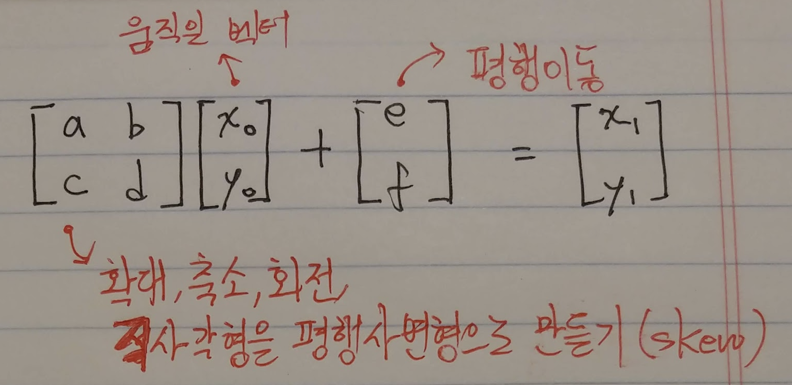
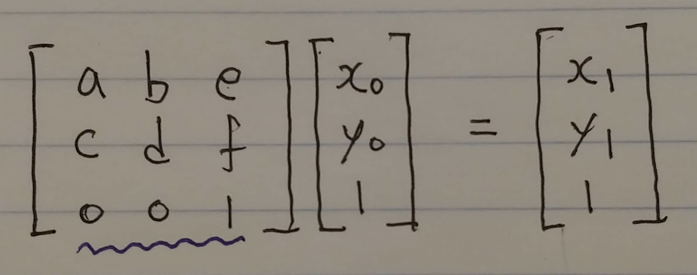
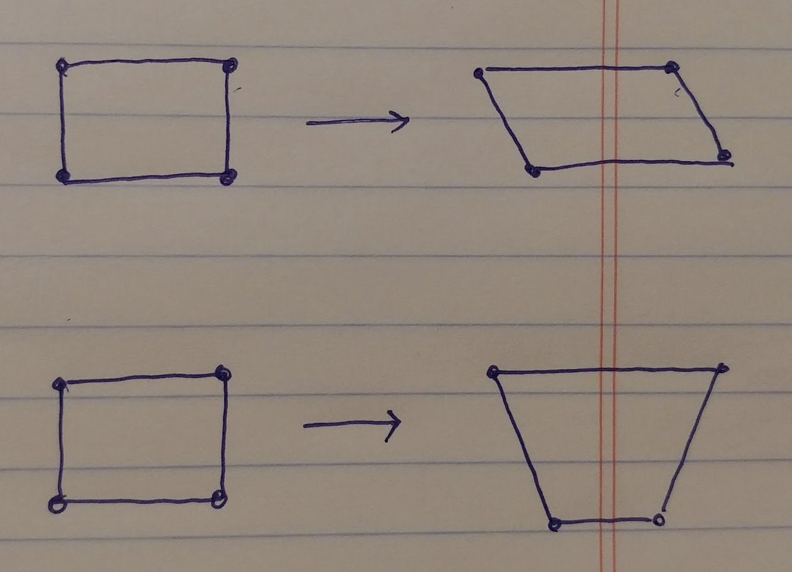
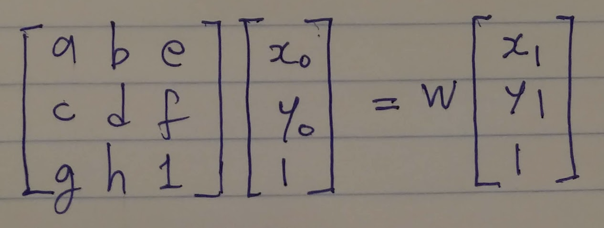

# 아핀 변환, 사영 변환

회사에서 2D 애니메이션 이야기를 하다가 'HTML 캔버스에서 특정 형태의 변환을 지원하지 않는다'는 이야기를 듣고 무슨 이야기인가 하고 찾아보았다.

2차원 평면에서 어떤 도형을 이루는 모든 점에 대해 선형변환을 해서 확대, 축소, 회전, skew를 할 수 있고, 다른 벡터를 더해서 평행이동을 할 수 있다. 이런 변환을 아핀 변환(affine transformation)이라고 부른다.

<figure>
  
  <figcaption>아핀 변환을 행렬로 나타내기</figcaption>
</figure>

그런데 이 식을 아래와 같이 3 * 3 행렬과 3 * 1 행렬의 곱셉으로 나타낼 수 있다. 이를 아핀 변환의 첨가행렬(augmented matrix)이라 부른다.

<figure>
  
  <figcaption>아핀 변환을 행렬의 곱셈만으로 나타내기</figcaption>
</figure>

위와 같이 표기하면, 여러 아핀변환이 연이어 일어나는 모양을 행렬의 곱으로 표현할 수 있기 때문에, 연산이 매우 간단해진다.

아핀 변환은 직사각형을 평행사변형으로 만들 수는 있지만 (다른 말로는, "삼각형을 임의의 다른 삼각형에 대응시킬 수 있다"), 직사각형을 사다리꼴로 만들 수는 없다는 특징(다른 말로는, "사각형을 임의의 다른 사각형에 대응시킬 수 있다")을 갖고 있다. 아핀 변환의 첨가 행렬에서, 맨 마지막 행의 두 0에 임의의 숫자를 넣어 직사각형을 사다리꼴로 만드는 변환 행렬을 만들 수 있고 이를 사영 변환(projective transformation, perspective transformation)이라 부른다.

<figure>
  
  <figcaption>아핀 변환 vs 사영변환</figcaption>
</figure>

사영 변환은 아핀 변환과 유사하게 아래와 같은 식으로 나타낼 수 있다고 한다. (아직 자세히 알아보지는 못했다.)

<figure>
  
  <figcaption>사영 변환을 행렬의 곱셈으로 나타내기</figcaption>
</figure>

