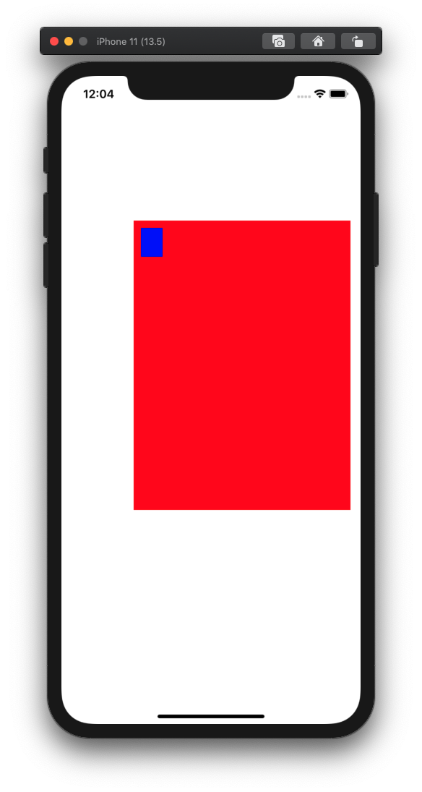

# UIView.bounds.origin

`UIView.bounds.origin`는 `bounds`의 '좌측 상단 꼭지점의 좌표'(iOS 기준)를 의미한다. 이걸 변경하면, 좌측 상단의 좌표가 바뀐 만큼 서브뷰 전체가 따라서 평행이동한다. 서브뷰 전체를 특정 위치로 옮기고 싶을 때 이 성질을 활용할 수 있다.

```swift
import UIKit

class ViewController: UIViewController {
    override func viewDidLoad() {
        super.viewDidLoad()
        
        let v1 = UIView(frame: CGRect(x: 100, y: 200, width: 300, height: 400))
        v1.backgroundColor = .red
        
        let v2 = UIView(frame: CGRect(x: 0, y: 0, width: 30, height: 40))
        v2.backgroundColor = .blue
        
        view.addSubview(v1)
        v1.addSubview(v2)
        
        print(v1.bounds)
        v1.bounds.origin = CGPoint(x: -10, y: -10)
        print(v1.bounds)
    }
}
```

출력 결과

```
(0.0, 0.0, 300.0, 400.0)
(-10.0, -10.0, 300.0, 400.0)
```

