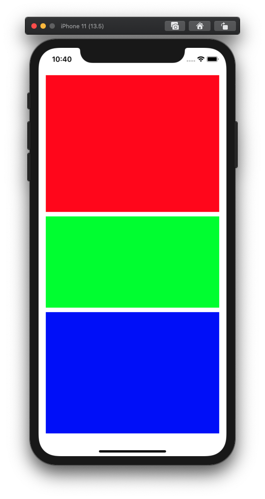
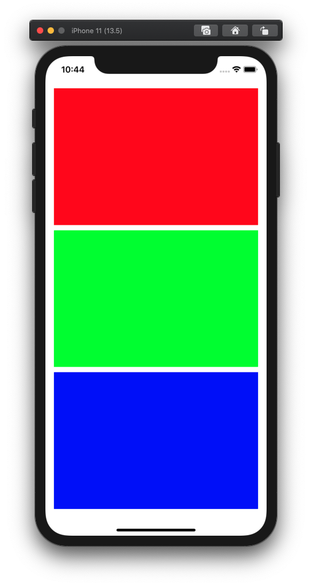
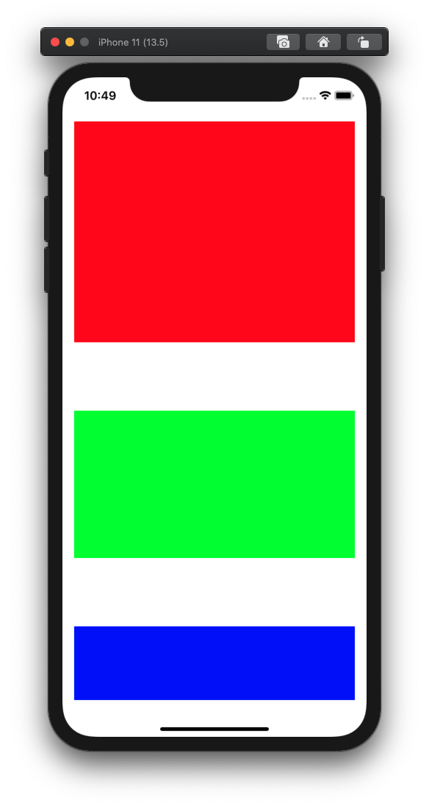
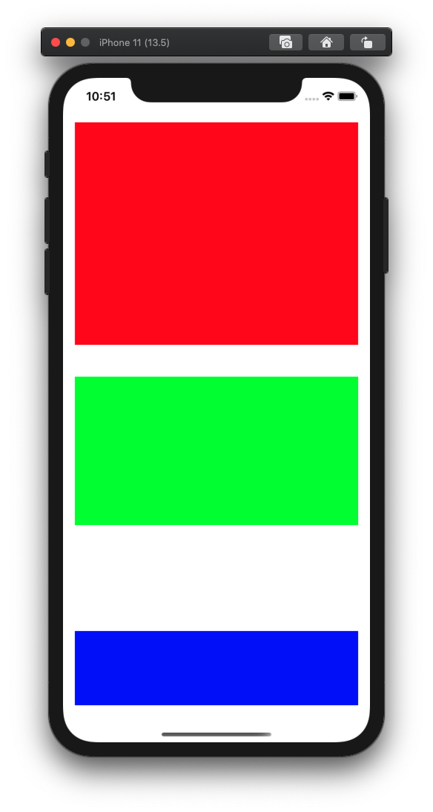

# iOS Auto Layout - UIStackView distribution

`UIStackView`는 자신의 모든 arranged subview에 대해 정해진 형태(가로축, 혹은 세로축을 따라 정렬)의 constraint를 생성해주는 편리한 뷰이다. arranged subview라고 한 것은 `addSubview(_:)` 대신 `addArrangedSubview(_:)` 메소드를 써야만 해당 서브뷰에 대한 constraint가 생성되기 때문이다. 기본적으로 constraint가 자동으로 생성되는 것이기 때문에, 직접 세팅한 constraint와 충돌하지 않도록 신경써주어야 한다.

`distribution` 속성을 사용해서 서브뷰를 어떻게 분포시킬 것인지를 설정할 수 있다. 다섯 종류의 case를 설정할 수 있다. 아래는 각 케이스별로 간단히 예제 코드를 작성해본 것이다.

```swift
// 뼈대

import UIKit

class ViewController: UIViewController {
    let stackView = UIStackView()
    let child1 = UIView()
    let child2 = UIView()
    let child3 = UIView()

    override func viewDidLoad() {
        super.viewDidLoad()
        
        prepare()
        test()
    }
    
    private func prepare() {
        view.addSubview(stackView)

        stackView.addArrangedSubview(child1)
        stackView.addArrangedSubview(child2)
        stackView.addArrangedSubview(child3)
        
        child1.backgroundColor = .red
        child2.backgroundColor = .green
        child3.backgroundColor = .blue
        
        stackView.translatesAutoresizingMaskIntoConstraints = false
        child1.translatesAutoresizingMaskIntoConstraints = false
        child2.translatesAutoresizingMaskIntoConstraints = false
        child3.translatesAutoresizingMaskIntoConstraints = false
        
        stackView.axis = .vertical
        stackView.alignment = .fill
        stackView.spacing = 10
        
        NSLayoutConstraint.activate([
                // stackView - horizontal
                stackView.leadingAnchor.constraint(equalTo: view.safeAreaLayoutGuide.leadingAnchor, constant: 16),
                stackView.trailingAnchor.constraint(equalTo: view.safeAreaLayoutGuide.trailingAnchor, constant: -16),
                
                // stackView - vertical
                stackView.topAnchor.constraint(equalTo: view.safeAreaLayoutGuide.topAnchor, constant: 16),
                stackView.bottomAnchor.constraint(equalTo: view.safeAreaLayoutGuide.bottomAnchor, constant: -16),
            ])
    }
    
    private func test() {
        // ...
    }
}
```

편의상 아래에서는 arranged subview를 '서브뷰'로 줄여서 적었다.

## .fill

서브뷰 중 최소한 하나는 (UIStackView에서 설정한 축과 같은 축에 해당하는) size constraint가 설정되어있지 않아야 한다. 해당 서브뷰를 늘려서 UIStackView를 꽉 채운다. 여기에서는 child3이 늘어난다.

```swift
private func test() {
    stackView.distribution = .fill
    
    NSLayoutConstraint.activate([
        child1.heightAnchor.constraint(equalToConstant: 300),
        
        child2.heightAnchor.constraint(equalToConstant: 200),
    ])
}
```



## .fillEqually

모든 서브뷰에 대해 (UIStackView에서 설정한 축과 같은 축에 해당하는) size constraint가 설정되어있지 않아야 한다. 모든 서브뷰를 같은 크기만큼 늘려서 UIStackView를 꽉 채운다.

```swift
private func test() {
    stackView.distribution = .fillEqually
}
```



## .fillPropositionally

모든 서브뷰에 대해 intrinsic content size가 있어야 하고, (UIStackView에서 설정한 축과 같은 축에 해당하는) size constraint가 설정되어있지 않아야 한다. intrinsic content size의 비율만큼 각 서브뷰를 늘려서 UIStackView를 꽉 채운다.

## .equalSpacing

모든 서브뷰가 intrinsic content size 혹은 size constraint를 가져야 한다. 해당 사이즈대로 서브뷰를 그리되, UIStackView의 끝에서 끝까지 등간격으로 퍼뜨린다.

```swift
private func test() {
    stackView.distribution = .equalSpacing
    
    NSLayoutConstraint.activate([
        child1.heightAnchor.constraint(equalToConstant: 300),
        
        child2.heightAnchor.constraint(equalToConstant: 200),
        
        child3.heightAnchor.constraint(equalToConstant: 100),
    ])
}
```



## .equalCentering

`.equalSpacing`과 비슷하지만, `.equalSpacing`은 서브뷰의 경계와 경계 사이가 등간격이 되게 만들지만, `.equalCentering`은 서브뷰의 중심과 중심 사이가 등간격이 되게 만든다는 점이 다르다.

```swift
private func test() {
    stackView.distribution = .equalCentering
    
    NSLayoutConstraint.activate([
        child1.heightAnchor.constraint(equalToConstant: 300),
        
        child2.heightAnchor.constraint(equalToConstant: 200),
        
        child3.heightAnchor.constraint(equalToConstant: 100),
    ])
}
```

