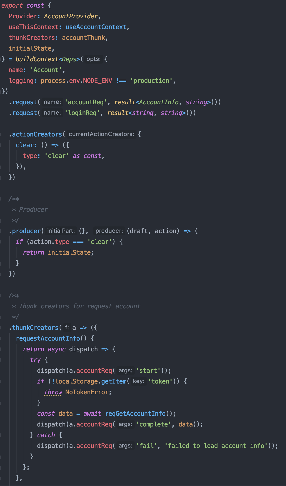

회사에서 새로운 React 프로젝트를 하기로 했는데, 예전부터 느껴왔던 불편함을 직접 해결해보고 싶어서 간단하게 라이브러리를 만들어보기로 했다.

- Hook, Context API 잘 활용하고 싶다
- 전역 상태는 싫다
- 함수형 사고방식이 좋지만, 타이핑을 많이 하는 것은 귀찮다

## Hook, Context API 잘 활용하고 싶다

클래스 컴포넌트 시대에는 cross cutting concern을 HOC를 통해 해결했지만, HOC는 '클래스 혹은 함수를 반환하는 함수'와 같이 꽤 난이도 있는 프로그래밍 기법을 필요로 하기 때문에 초심자들이 많이 혼란스러워하기도 하고 정의/사용하는 것도 꽤 귀찮은 일이었다. Hook이 나오고나서 비슷한 일을 훨씬 더 적은 타이핑으로 해결할 수 있게 됐고, 다시 HOC를 쓰라고 하면 굉장히 불편할 것 같다. 그래서 이번에 하는 프로젝트는 클래스 컴포넌트를 아예 하나도 사용하지 않는 것을 목표로 잡았다.

Context API는 훅 때문에 사용법이 굉장히 편해진 것들 중 하나인데, 훅 이전의 context API는 consumer의 'function as a child'라는 굉장히 괴상한 사용법을 갖고 있었고, 이걸 편하게 쓰려면 또 HOC를 만들어서 (...) 해결해야 했기에 여간 귀찮은 것이 아니었다. useContext 훅을 사용하면 이런 번거로움 없이 한번에 Provider 컴포넌트에서 내려주는 값을 받아올 수 있으니, useContext 등장 이전과 이후에 체감되는 난이도의 차이가 꽤 크게 느껴진다.

## 전역 상태는 싫다

Redux, MST 등 전역 상태 스토어를 반강제하는 라이브러리를 사용하는 프로젝트를 몇 번 겪어보고 나서, 전역 스토어를 사용하는 것을 굉장히 비관적으로 바라보게 됐다.

좋은 설계란 기본적으로 구성요소 별로 역할과 책임을 잘 분리하고, 서로 상관없는 것들을 격리해서 서로가 서로에 대해서 모르게 하는 것부터가 시작이다. 그런데 전역 스토어를 사용하면 이를 깔끔하게 나누기가 굉장히 어렵다. 이를 위한 몇몇 컨벤션이 있지만 (action 이름 앞에 prefix를 붙인다거나, ducks 패턴으로 상태를 수평분할 한다거나), 어떤 기술을 사용하기가 어려워서 컨벤션으로 해결해야하는 경우가 많다면, 그 기술 자체에 문제가 있는 건 아닐까 의심해 볼 필요가 있다.

또한 전역 스토어를 잘 쓰려면 데이터 정규화가 필수적인데, 일을 하다 보면 FE에서 정규화된 데이터를 받을 수 있는 환경이 갖춰지지 않은 경우가 더 많다. (서버에서 이를 잘 지원해주어야 하는데, 어렵다.)

그리고 무엇보다도, 전역 스토어는 웹의 근본적인 사용자 경험 - 이동할 때마다 새로운 데이터가 불러와진다 - 과 맞지 않는다. 압도적 다수의 경우에서, 상태는 일회성 UI를 표시하기 위해서 존재한다. 사용자가 내비게이션을 하면, 사용자가 원하는 UI를 표시해주기 위한 데이터를 불러온 뒤, 한 번 사용하고 버려도 충분하다. 사용자가 다른 곳으로 이동했다가 다시 돌아온다면, 서버로부터 데이터를 다시 불러오면 된다. (캐시, 하면 좋다. 하지만 꼭 필요한 경우에만 하면 되고, 캐시를 굳이 UI 상태에 저장할 필요도 없다.)

사용자가 다른 곳으로 이동했을 때, 전역 스토어의 일부를 제대로 비우지 못해서 버그를 만들어낸 경험은 FE 개발자라면 다들 한 번씩은 있을 것이다.

UI 표현을 위한 상태는 해당 UI와 같은 단위로 관리하는 것이 좋지 않을까? 그래서 이번 프로젝트에서는 외부 상태 스토어를 쓰지 않고 모든 상태를 컴포넌트 트리 안에 두는 방향으로 시도해보기로 했다. 이렇게 하면, UI가 사라졌을 때 상태도 같이 없어지므로 위와 같은 버그를 겪을 일이 없다.

## 함수형 사고방식이 좋지만, 타이핑을 많이 하는 것은 귀찮다

개인적으로 2015년에 처음으로 Redux 문서를 읽었던 순간이 내 개발자 인생의 터닝 포인트라고 생각한다. 나에게 Redux는 여러가지 함수형 사고방식을 알려준 굉장히 고마운 기술이다. 리듀서, 액션, 썽크, 불변성, 메모이제이션 등등은 여전히 매력적이고 익숙하게 활용할 수 있는 것들이라, 이번 프로젝트에서도 활용해보고 싶었다.

하지만 Redux 문서 및 생태계에서 권장하는 방식대로 useReducer를 쓰려고 보니, 시작도 하기 전에 손가락이 먼저 아픈 느낌이었다. 액션 타입과 액션 크리에이터 따로 정의하고, 이에 대한 TypeScript 인터페이스 일일이 정의하고, 매 API 요청에 대해 `_REQUEST`, `_SUCCESS`, `_FAILURE` 액션 다 따로 만들어주고...

왠지 이것보다 더 좋은 방법이 있을 것 같았다.

## 그래서 직접 만들었다

현재 목표로 하고 있는 것들은

- Redux에서 제시한 개념을 거의 그대로 활용 (리듀서, 액션, 썽크, 불변성, ...)
- 타입 추론을 최대한 활용해서, 최소한의 인터페이스만 만들고도 문제없이 타입 체크가 가능하도록 만들기
- 상태는 컴포넌트 내부에 존재
- Context API 활용해서 편하게 쓸 수 있게
- 개발 편의성을 위한 액션 로깅 (redux-logger를 많이 참고했다)
- 상태 모킹을 쉽게 할 수 있게. 그래서 문제없이 스토리북 그릴 수 있게
- 의존성 주입 가능하게. 그래서 React와 React Native 양쪽에서 쓰는 것을 편하게 만들기

프로젝트가 진행되어 남은 과제들이 어느정도 해결되면 오픈소스로도 공개해볼 생각이다.