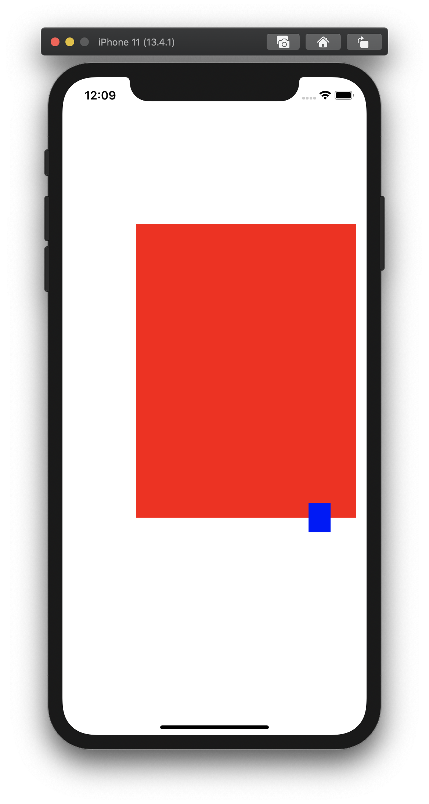
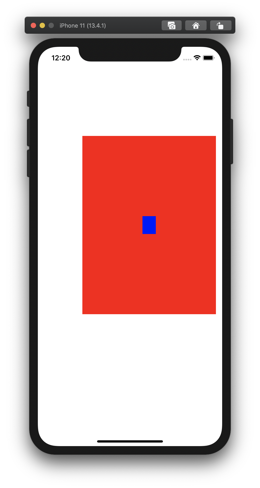

UIView 인스턴스는 CGRect 타입의 `frame`, `bounds` 속성을 갖는다. 둘 다 해당 UIView 인스턴스를 둘러싸고 있는 사각형 박스를 나타내지만, `frame` 속성은 **부모 좌표계** 내에서의 사각형을, `bounds`는 **자신의 좌표계** 내에서의 사각형을 나타낸다. 예를 들어, Single View App을 만들고 아래처럼 코드를 작성하고 실행하면,

```swift
class ViewController: UIViewController {
    override func viewDidLoad() {
        super.viewDidLoad()

        let v1 = UIView(frame: CGRect(x: 100, y: 200, width: 300, height: 400))
        v1.backgroundColor = .red
        
        let v2 = UIView(frame: CGRect(x: 10, y: 20, width: 30, height: 40))
        v2.backgroundColor = .blue
        
        self.view.addSubview(v1)
        v1.addSubview(v2)

        print("v1.frame", v1.frame)
        print("v1.bounds", v1.bounds)
        print("v2.frame", v2.frame)
        print("v2.bounds", v2.bounds)
    }
}
```

이렇게 출력된다.


```
v1.frame (100.0, 200.0, 300.0, 400.0)
v1.bounds (0.0, 0.0, 300.0, 400.0)
v2.frame (10.0, 20.0, 30.0, 40.0)
v2.bounds (0.0, 0.0, 30.0, 40.0)
```

(당연하게도) UIView를 생성할 때 넣어준 `frame`이 그대로 출력되었다. `bounds`는 좀 다르게 출력되었는데, UIView는 기본적으로 좌상단 꼭지점이 원점이기 때문에, (별다른 수정을 하지 않았다면) `bounds` 속성의 `x`, `y` 값은 모두 `0.0` 인 것이 맞다.

각각의 좌표계가 서로 다르기 때문에, `CGPoint`나 `CGRect`를 다룰 때는 어떤 좌표계상의 점인지를 잘 생각해야 한다. 예를 하나 들어보자. v1의 크기를 사전에 알 수 없다는 가정 하에, v2를 정확히 v1의 중간에 위치시키려면 어떻게 해야 할까?

UIView의 `center` 속성에는 `frame`이 나타내는 사각형의 중점을 가리키는 `CGPoint` 인스턴스가 들어있다. 이 값을 바꾸면, 화면 상의 UIView의 위치가 실제로 갱신된다. 그렇다면

```swift
v2.center = v1.center
```

이렇게 하면 어떻게 될까? 의도와는 다르게 동작한다.



`v1.center`는 `v1.frame`의 중점이다. 즉 v1의 부모 좌표계(즉, 위 코드에서 `self.view` 좌표계)에서의 점이다. 반면에, `v2.center`는 `v2.frame`의 중점이고, 즉 v2의 부모 좌표계, 다시 말하면 v1 좌표계에서의 점이다. 다른 좌표계에 있는 점을 가져다 대입하려고 하니 당연히 제대로 동작할 리 없다. 말하자면, `self.view` 좌표계의 원점에서 시작해서 `v1.center`에서 끝나는 벡터를, v1 좌표계의 원점으로 옮겨놓은 것이다.


의도대로 동작시키려면, `v1.center`를 v1의 좌표계 기준으로 바꾸어주어야 한다. 이를 위해 `UIView.convert` 함수가 준비되어 있다.

```swift
// v1.center는 self.view 좌표계 상의 점이다. 이를 v1 좌표계의 점으로 바꾼 후, v2.center에 대입해주어야 한다.
v2.center = v1.convert(v1.center, from: self.view)
```

이렇게 하면 의도대로 잘 출력된다.

