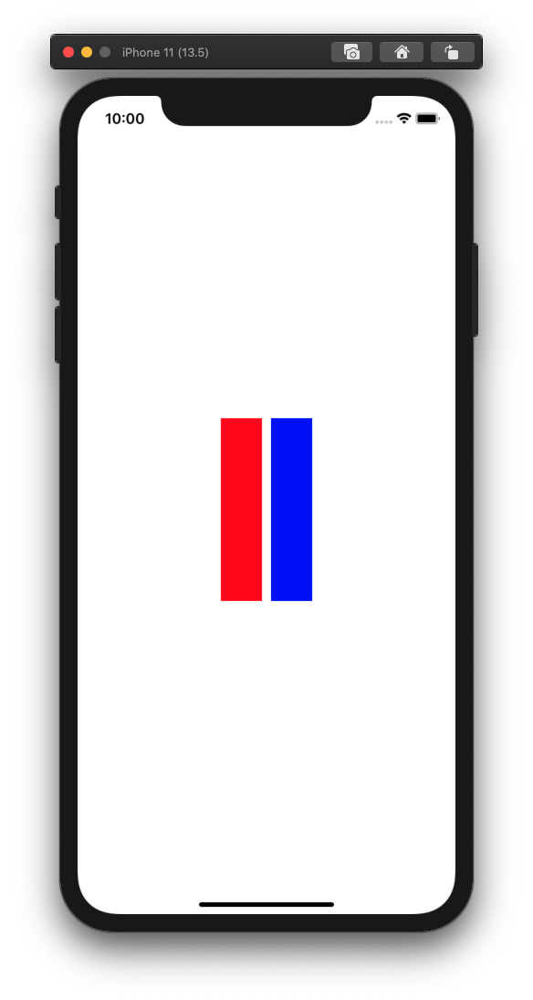

Programming iOS 13 - Layout 파트 보는 중

Autolayout으로 두 개의 UIView를 같이 중앙정렬 (화면 중앙에 나란히 두 개의 뷰) 하고 싶으면 어떻게 해야할까? 생각해봤는데, 단순하게는 두 개를 하나의 UIView로 감싸서 그 놈을 중앙정렬 하면 되지 않을까? 생각했다.

그런데 부모 뷰를 만들지 않고도 같은 목적을 달성할 수 있는 방법이 있었다. UIView 인스턴스는 아니지만, 레이아웃 상의 부모 역할을 해 줄 UILayoutGuide를 만들면 된다.

레퍼런스 문서를 보니 iOS 9.0 이전까지는 dummy view를 만들어야 했지만, 이 방법에는 단점이 있다고 한다.

- 더미 뷰를 직접 관리해주어야 한다.
- 뷰 계층구조를 대상으로 하는 작업에 끼어들게 되므로, 불필요한 오버헤드가 생긴다.
- 더미 뷰가 메시지를 가로채는 버그가 생길 수 있고, 이는 찾기 어려운 버그다.

참고 - `safeAreaLayoutGuide`, `layoutMarginsGuide`가 UILayoutGuide의 인스턴스다.

```swift

import UIKit

class ViewController: UIViewController {
    let centerSpace = UILayoutGuide()
    let v1 = UIView()
    let v2 = UIView()

    override func viewDidLoad() {
        super.viewDidLoad()
        
        setupViews()
        setupConstraints()
    }
    
    func setupViews() {
        v1.backgroundColor = .red
        v2.backgroundColor = .blue
        
        view.addSubview(v1)
        view.addSubview(v2)
        view.addLayoutGuide(centerSpace)
    }
    
    func setupConstraints() {
        v1.translatesAutoresizingMaskIntoConstraints = false
        v2.translatesAutoresizingMaskIntoConstraints = false

        NSLayoutConstraint.activate([
            // layout guides - horizontal
            centerSpace.centerXAnchor.constraint(equalTo: view.safeAreaLayoutGuide.centerXAnchor),
            centerSpace.widthAnchor.constraint(equalToConstant: 100),

            // layout guides - vertical
            centerSpace.centerYAnchor.constraint(equalTo: view.safeAreaLayoutGuide.centerYAnchor),
            centerSpace.heightAnchor.constraint(equalToConstant: 200),
            
            // views - horizontal
            v1.leadingAnchor.constraint(equalTo: centerSpace.leadingAnchor),
            v1.widthAnchor.constraint(equalTo: centerSpace.widthAnchor, multiplier: 0.5, constant: -5),
            v2.trailingAnchor.constraint(equalTo: centerSpace.trailingAnchor),
            v2.widthAnchor.constraint(equalTo: centerSpace.widthAnchor, multiplier: 0.5, constant: -5),
            
            // views - vertical
            v1.topAnchor.constraint(equalTo: centerSpace.topAnchor),
            v1.bottomAnchor.constraint(equalTo: centerSpace.bottomAnchor),
            v2.topAnchor.constraint(equalTo: centerSpace.topAnchor),
            v2.bottomAnchor.constraint(equalTo: centerSpace.bottomAnchor),
        ])
    }
}
```

출력 결과

